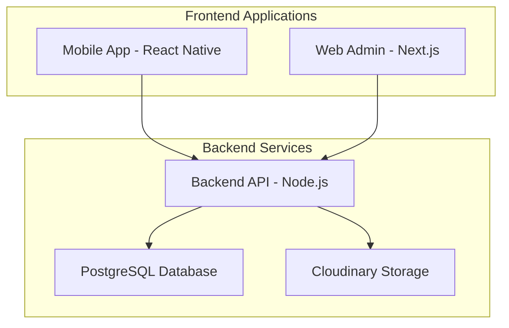

# Surveyor Attendance Management System (SAMS)

A comprehensive full-stack application for managing field surveyor attendance and bike meter readings with GPS tracking, photo verification, and interactive map visualization.

## 🏗️ System Architecture



## 📱 Applications

### 🔹 Mobile App (React Native + Expo)
**Location**: `./mobile-app/`

Field application for surveyors to mark attendance and upload bike meter readings.

**Key Features:**
- GPS-based attendance marking with selfie verification
- Bike meter photo upload with manual KM entry
- Real-time location tracking
- Offline-ready architecture
- Cross-platform (iOS/Android/Web)

**Tech Stack:**
- React Native with Expo
- Redux Toolkit for state management
- Camera and GPS integration
- JWT authentication

### 🔹 Web Admin Portal (Next.js)
**Location**: `./web-admin/`

Administrative dashboard for managing surveyors, viewing reports, and analyzing data.

**Key Features:**
- Surveyor management (CRUD operations)
- Interactive attendance reports with map visualization
- Bike meter reading analytics
- Real-time dashboard with charts
- Advanced filtering and export capabilities
- **Interactive Maps**: Leaflet-based coordinate visualization

**Tech Stack:**
- Next.js 13+ with App Router
- TypeScript for type safety
- Material-UI v5 components
- Leaflet & React-Leaflet for maps
- Recharts for analytics

### 🔹 Backend API (Node.js + Express)
**Location**: `./backend/`

RESTful API server handling authentication, data management, and file uploads.

**Key Features:**
- JWT-based authentication with role management
- Prisma ORM with PostgreSQL
- Cloudinary integration for image storage
- Rate limiting and security middlewares
- Comprehensive API documentation

**Tech Stack:**
- Node.js with Express
- Prisma ORM
- PostgreSQL database
- Cloudinary for file storage
- Zod for validation

## 🚀 Quick Setup

### Prerequisites
- Node.js 18+ and npm
- PostgreSQL database (Supabase recommended)
- Cloudinary account
- Expo CLI (for mobile development)

### Automated Setup
We provide cross-platform setup scripts for easy environment initialization:

**Windows:**
```bash
./setup.bat
```

**Linux/MacOS:**
```bash
./setup.sh
```

**Start All Services:**
```bash
./start-dev.bat  # Windows
```

### Manual Setup

1. **Clone the repository:**
   ```bash
   git clone <repository-url>
   cd Surveyor-Attendance-Management-System
   ```

2. **Backend Setup:**
   ```bash
   cd backend
   npm install
   cp .env.example .env
   # Configure your environment variables
   npm run db:generate
   npm run db:migrate
   npm run db:seed
   npm run dev
   ```

3. **Web Admin Setup:**
   ```bash
   cd web-admin
   npm install
   # Create .env.local with your configuration
   npm run dev
   ```

4. **Mobile App Setup:**
   ```bash
   cd mobile-app
   npm install
   # Update .env with backend URL
   npm start
   ```

## 🔐 Default Credentials

**Admin Access:**
- Mobile: `+1234567890`
- Password: `admin123`

**Sample Surveyors:**
- John Smith: `+1234567891` / `surveyor123`
- Sarah Johnson: `+1234567892` / `surveyor123`
- Mike Wilson: `+1234567893` / `surveyor123`

## 🌐 Service URLs

| Service | Development URL | Description |
|---------|----------------|-------------|
| Backend API | http://localhost:5000 | RESTful API server |
| Web Admin | http://localhost:3000 | Administrative dashboard |
| Mobile App | http://localhost:19000 | Expo development server |

## 📊 Key Features

### 🎯 Core Functionality
- **Attendance Tracking**: GPS-based check-in/check-out with photo verification
- **Bike Meter Management**: Odometer reading uploads with photo evidence
- **User Management**: Complete CRUD operations for surveyors
- **Real-time Dashboard**: Live statistics and analytics
- **Interactive Maps**: Leaflet-based coordinate visualization for attendance locations

### 🛡️ Security Features
- JWT-based authentication with role management
- Rate limiting and security headers
- Input validation and sanitization
- Secure file upload with restrictions
- CORS configuration

### 📈 Analytics & Reporting
- Real-time dashboard with charts
- Weekly and monthly trend analysis
- Comprehensive filtering options
- CSV and PDF export capabilities
- Interactive map views for location data

### 🗺️ Map Integration
- **Individual Location View**: Click coordinates to view on interactive map
- **Bulk Location View**: Visualize all attendance locations simultaneously
- **Custom Markers**: Color-coded for different attendance types
- **Rich Popups**: Complete attendance details with photos
- **Responsive Design**: Works on all devices

## 📁 Project Structure

```
Surveyor-Attendance-Management-System/
├── backend/                 # Node.js API server
│   ├── prisma/             # Database schema and migrations
│   ├── src/                # Source code
│   └── README.md           # Backend documentation
├── web-admin/              # Next.js admin portal
│   ├── src/                # Source code
│   └── README.md           # Web admin documentation
├── mobile-app/             # React Native mobile app
│   ├── src/                # Source code
│   └── README.md           # Mobile app documentation
├── Essentials/             # Project documentation
│   └── Documentation.txt   # Implementation status
├── setup.bat               # Windows setup script
├── setup.sh                # Linux/MacOS setup script
├── start-dev.bat           # Development starter script
└── README.md               # This file
```

## 🔧 Environment Configuration

Each application requires specific environment variables:

### Backend (.env)
```env
DATABASE_URL="postgresql://..."
JWT_SECRET="your_jwt_secret"
CLOUDINARY_CLOUD_NAME="your_cloud_name"
CLOUDINARY_API_KEY="your_api_key"
CLOUDINARY_API_SECRET="your_api_secret"
```

### Web Admin (.env.local)
```env
NEXT_PUBLIC_API_BASE_URL=http://localhost:5000/api
NEXT_PUBLIC_APP_NAME=SAMS Admin Portal
```

### Mobile App (.env)
```env
API_BASE_URL=http://localhost:5000/api
APP_NAME=Surveyor Attendance
```

## 🧪 Testing

### API Testing
- Use Postman or any REST client
- Health check: `GET http://localhost:5000/health`
- Authentication required for most endpoints

### Frontend Testing
- Web admin accessible at http://localhost:3000
- Mobile app testable via Expo Go or simulators
- Use demo credentials for quick testing

## 🚀 Deployment

### Production Build
Each application can be built for production:

```bash
# Backend
cd backend && npm run build && npm start

# Web Admin
cd web-admin && npm run build && npm start

# Mobile App
cd mobile-app && expo build:android/ios
```

### Database Migration
```bash
cd backend && npm run db:migrate
```

## 📚 Documentation

- **Backend API**: [./backend/README.md](./backend/README.md)
- **Web Admin**: [./web-admin/README.md](./web-admin/README.md)
- **Mobile App**: [./mobile-app/README.md](./mobile-app/README.md)
- **Implementation Status**: [./Essentials/Documentation.txt](./Essentials/Documentation.txt)

## 🛠️ Development Workflow

1. **Backend First**: Ensure API is running and accessible
2. **Database Setup**: Run migrations and seed data
3. **Web Admin**: Test admin functionality and reports
4. **Mobile App**: Test field operations and data sync
5. **Integration**: Verify end-to-end workflows

## 🐛 Troubleshooting

### Common Issues

1. **Database Connection**: Verify DATABASE_URL and PostgreSQL service
2. **API Calls Failing**: Check CORS settings and API base URLs
3. **File Uploads**: Verify Cloudinary credentials
4. **Mobile App**: Ensure backend URL is accessible from device

### Debug Tips
- Check browser console for frontend errors
- Monitor backend logs for API issues
- Use Expo Dev Tools for mobile debugging
- Verify environment variables are loaded

## 🤝 Contributing

1. Follow TypeScript best practices
2. Maintain consistent code formatting
3. Add proper error handling
4. Update documentation for new features
5. Test on multiple devices/browsers

## 📄 License

Private project developed for LRMC Solutions.

---

**Built with ❤️ by the SAMS Development Team**

**Last Updated**: January 2025  
**Version**: 1.0.0  
**Status**: Production Ready